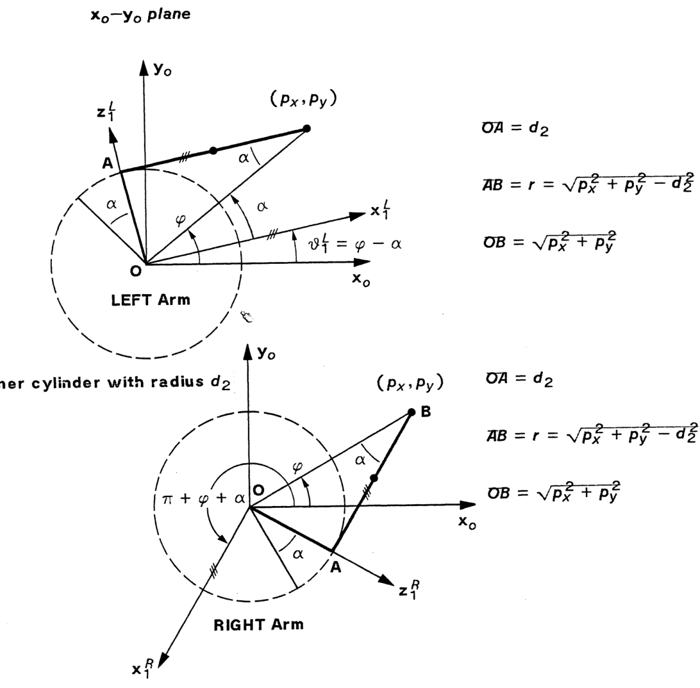
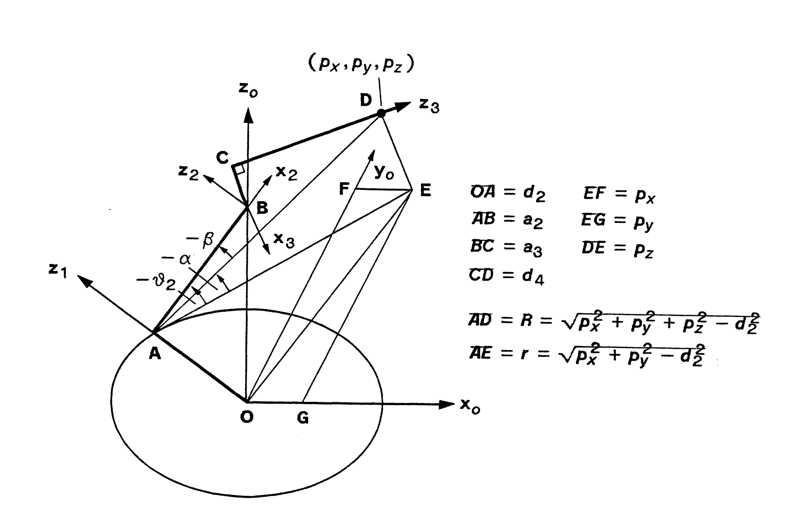
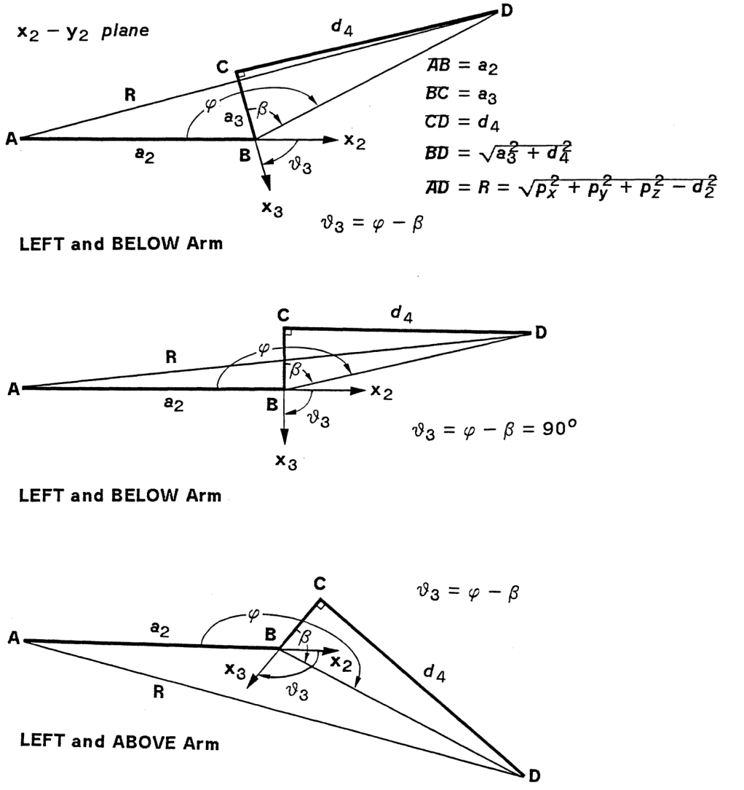

# Introduction
Inverse kinematics problem deals with the determination of joint variables given a desired position and orientation for the tool. The inverse kinematics problem is significant because manipulation tasks are usually formulated in terms of the desired tool position and orientation. Analysis of Inverse Kinematics is in general more difficult and not straightforward like Forward Kinematics problem. Exact solution of Inverse Kinematics problem for complex configure manipulator is very difficult. The solution of Inverse Kinematics problem for control of a robot manipulator is attempted using various methods such as algebraic methods, geometric methods, and numerical methods. Algebraic methods are used to obtain closed-form solutions, but these methods, do not guarantee closed form solutions.

# Theory

Given the end-effector position and orientation from Forward kinematics problem, the inverse kinematics approach is used to obtain the joint angles. But as stated in the introduction inverse kinematics is more difficult problem than forward kinematics as its include much complexity. The relationship between forward and inverse kinematics is shown in Figure 1. In general there are two main solution techniques for inverse kinematics problem one is analytic approach and other is numerical method. Analytic approach comprises of geometric and algebraic solutions in which joint variables are solved analytically according to given configuration data.

***Figure 1. The schematic representation of forward and inverse kinematics.***

Solving the problem of finding the required joint angles to place the tool frame, {T}, relative to the station frame, {S}, is split into two parts. First, frame transformations are performed to find the wrist frame, {W}, relative to the base frame, {B}, and then the inverse kinematics are used to solve for the joint angles.

Which corresponds to \\( T_0^4\\) position

$$ p=p_6 - d_6 a = (p_x,p_y,p_z)^T $$
$$ \\begin{bmatrix} p_x \\\ p_y \\\ p_z \\end{bmatrix} = \\begin{bmatrix} C_1(a_2C_2+a_3C_{23}+d_4S_{23})-d_2S_1 \\\ S_1(a_2C_2+a_3C_{23}+d_4S_{23})+d_2C_1 \\\ d_4C_{23}-a_3S_{23}-a2S_2 \\end{bmatrix} $$

## Solution for Joint 1

$$ \\theta_1^L = \\phi - \\alpha ; \\quad \\theta_1^R = \\pi + \\phi + \\alpha $$

$$ r = \\sqrt{ p_x^2 + p_y^2 - d_2^2 }; \\quad R = \\sqrt{ p_x^2 + p_y^2 } $$

$$ sin(\\phi) = \\frac{p_y}{R} ; \\quad cos(\\phi) = \\frac{p_x}{R} $$

$$ sin(\\alpha) = \\frac{d_2}{R} ; \\quad cos(\\alpha) = \\frac{r}{R} $$

$$ sin(\\theta_1^L) = sin(\\phi - \\alpha) = sin(\\phi)cos(\\alpha) - cos(\\phi)sin(\\alpha) = \\frac{p_y r - p_x d_2}{R^2} $$

$$ cos(\\theta_1^L) = cos(\\phi - \\alpha) = cos(\\phi)cos(\\alpha) + sin(\\phi)sin(\\alpha) = \\frac{p_x r + p_y d_2}{R^2} $$

$$ sin(\\theta_1^R) = sin(\\pi + \\phi + \\alpha) = \\frac{- p_y r - p_x d_2}{R^2} $$

$$ cos(\\theta_1^R) = cos(\\pi + \\phi + \\alpha) = \\frac{- p_x r + p_y d_2}{R^2} $$

$$ sin(\\theta_1) = \\frac{-ARM p_y \\sqrt{p_x^2+p_y^2 - d_2^2}-p_x d_2}{p_x^2+p_y^2} $$

$$ cos(\\theta_1) = \\frac{-ARM p_y \\sqrt{p_x^2+p_y^2 - d_2^2}+p_y d_2}{p_x^2+p_y^2} $$

$$ \\theta = a tan2 \\begin{bmatrix} y \\\ x \\end{bmatrix} = \\Biggl \\{ \\begin{pmatrix} 0^o \\leq \\theta \\leq 90^o ; \\quad + x and + y \\\ 90^o \\leq \\theta \\leq 180^o ; \\quad - x and + y \\\  -180^o \\leq \\theta \\leq -90^o ; \\quad - x and - y \\\ -90^o \\leq \\theta \\leq 0^o ; \\quad + x and - y \\\  \\end{pmatrix} $$

$$ \\theta_1 = a tan2 \\begin{bmatrix} \\frac{sin(\\theta_1)}{cos(\\theta_1)} \\end{bmatrix} = a tan2 \\begin{bmatrix} \\frac{-ARM p_y \\sqrt{p_x^2+p_y^2 - d_2^2}-p_x d_2}{-ARM p_y \\sqrt{p_x^2+p_y^2 - d_2^2}+p_y d_2} \\end{bmatrix} $$

## Solution for Joint 2

$$ R = \\sqrt{ p_x^2 + p_y^2 + p_z^2 - d_2^2 }; \quad r = \\sqrt{ p_x^2 + p_y^2 - d_2^2 } $$

$$ sin(\\alpha) = - \\frac{p_z}{R} = - \\frac{p_z}{\\sqrt{ p_x^2 + p_y^2 + p_z^2 - d_2^2 }} $$

$$ cos(\\alpha) = - \\frac{ARM r}{R} = - \\frac{ARM \\sqrt{ p_x^2 + p_y^2 - d_2^2 } }{\\sqrt{ p_x^2 + p_y^2 + p_z^2 - d_2^2 }} $$

$$ cos(\\beta) = - \\frac{a_2^2 + R^2 - (d_4^2+a_3^2)}{2 a_2 R} = - \\frac{a_2^2 + p_x^2 + p_y^2 + p_z^2 - d_2^2 - (d_4^2+a_3^2)}{2 a_2 \\sqrt{p_x^2 + p_y^2 + p_z^2 - d_2^2}} $$

$$ sin(\\beta) = \\sqrt{1 - cos^2 \\beta} $$

$$ sin( \\theta_2 ) = sin( \\alpha + K * \\beta) = sin( \\alpha ) cos(\\beta) + (ARM*ELBOW) cos( \\alpha ) sin(\\beta) $$

$$ cos( \\theta_2 ) = cos( \\alpha + K * \\beta) = cos( \\alpha ) cos(\\beta) - (ARM*ELBOW) sin( \\alpha ) sin(\\beta) $$

$$ \\theta_2 = a tan2 \\begin{bmatrix} \\frac{sin(\\theta_2)}{cos(\\theta_2)} \\end{bmatrix} ; \\quad  - \\pi \\leq \\theta_2 \\leq \\pi $$

## Solution for Joint 3

$$ R = \\sqrt{ p_x^2 + p_y^2 + p_z^2 - d_2^2 } $$

$$ cos( \\phi ) = \\frac{a_2^2+(d_4^2+a_3^2)-R^2}{2 a_2 \\sqrt{d_4^2+a_3^2}}; \\quad sin(\\phi) = ARM * ELBOW \\sqrt{1 - cos^2 \\phi} $$

$$ sin( \\beta ) = \\frac{d_4}{d_4^2+a_3^2}; \\quad cos( \\beta ) = \\frac{ \|a_3 \| }{d_4^2+a_3^2} $$

$$ \\theta_3 = \\phi - \\beta $$

$$ \\theta_3 = a tan2 \\begin{bmatrix} \\frac{sin(\\theta_3)}{cos(\\theta_3)} \\end{bmatrix} ; \\quad - \\pi \\leq \\theta_3 \\leq \\pi $$

## Solution for Joint 4

$$ sin( \\theta_4 ) = - (z_4 * x_3) $$
$$ cos( \\theta_4 ) = (z_4 * y_3) $$

## Solution for Joint 5

$$ sin( \\theta_5 ) = a * x_4 $$
$$ cos( \\theta_5 ) = - (a * y_4) $$

## Solution for Joint 6

$$ sin(\\theta_6) = n * y_5; \\quad cos(\\theta_6) = s * y_5 $$

$$ \\theta_6 = a tan2 \\begin{bmatrix} \\frac{sin(\\theta_6)}{cos(\\theta_6)} \\end{bmatrix} ; \\quad - \\pi \\leq \\theta_6 \\leq \\pi $$

$$ \\theta_6 = a tan2 \\begin{bmatrix} \\frac{ ( - S_1 C_4 - C_1 C_{23} S_4) n_x + (C_1 C_4 - S_1 C_{23} S_4) n_y + (S_4 S_{23}) n_z}{( - S_1 C_4 - C_1 C_{23} S_4) s_x + (C_1 C_4 - S_1 C_{23} S_4) s_y + (S_4 S_{23}) s_z} \\end{bmatrix} ; $$

